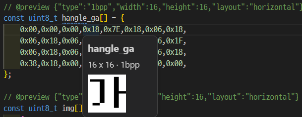

# Graphic Preview for Visual Studio Code

[Support me on Ko-fi!](https://ko-fi.com/xxxxx)



Preview embedded bitmap and image data directly from C and C++ source code in Visual Studio Code.

Graphic Preview reads metadata from a source comment, parses the associated array, and renders the result when you hover over the array name or its contents.

This extension is currently under development. The supported formats and metadata syntax may change.

## Features

- Preview C and C++ array data on hover
- Explicit metadata-based format selection
- 1bpp bitmap rendering
- Horizontal and vertical data layouts
- Support for .c, .h, .cpp, and .hpp files

## Usage

Add an `@preview` annotation immediately above the array.

```c
/**
 * @brief Example 1bpp image
 * @preview {"type":"1bpp","width":16,"height":16,"layout":"horizontal"}
 */
const uint8_t example_image[] = {
    0xFF, 0xFF,
    0x80, 0x01,
    0x80, 0x01,
    0x8C, 0x31,
    0x8C, 0x31,
    0x80, 0x01,
    0x81, 0x81,
    0xC0, 0x03,
    0xA0, 0x05,
    0x90, 0x09,
    0x8F, 0xF1,
    0x80, 0x01,
    0x80, 0x01,
    0x80, 0x01,
    0x80, 0x01,
    0xFF, 0xFF
};
```

## How to build

```bash
# install dependencies
npm install pngjs
npm install --save-dev @types/pngjs

# build extension
npm run compile
```

## Release Notes

### 0.0.1

Test version :)